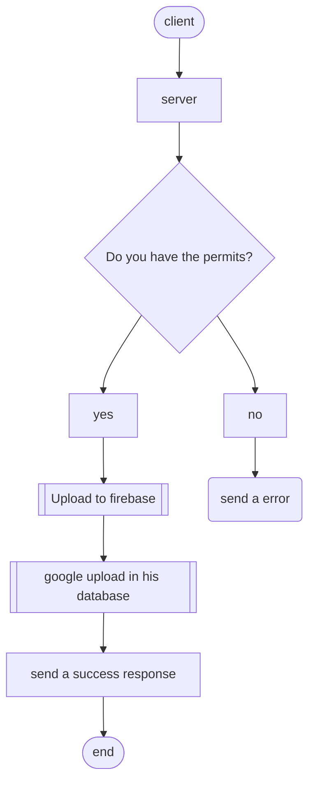
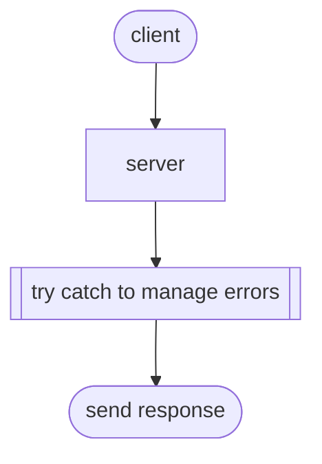

# upload-to-server 
Generally if you want your users to upload photos you need a service like firebase, or another in aws.
this code explains how to upload photos to the server
upload
## Architecture if you use Firebase

## why this code is a good idea ?
if you have a small project that needs to upload images the above code can help you a lot.
you don't need to register to a service and the code is small
In this example I use express file-upload in this example the server manage all and not use a database
### architecture of this code

## Explanation
  ### modules you need
   + express
   + express fileupload
  ### flow
  first the client send a request for the server in this case our server in express has a special route, if you want upload a file this is the root send a     html file  this has a form in that form you can upload your code in your OS.
  later you can submit files the HTML and JS code are not explained, becuase I thought is very easy to understand
  the form send a request from a special path of my API with a verbose POST this function callback has 4 middlewares 
  for check the file or multiple files
## midlewares
  ### fileUpload
  this middleware has by default the parameter that creates a folder where the images will be stored.
  is included in express-fileupload
  ```
    app.post(
      "/upload", 
      fileUpload({ createParentPath: true}),
  ```
  ### filePayloadExist
  this function exists because of the need to check that the image has arrived.
  checks if files were sent to it uses a guard clausure if it does not exist it sends an error if they do exist it executes next to go to the next middleware
  ```
    const filesPayloadExists = (req, res, next) =>{
      if(!req.files) return res.status(400).json({status: "error", message: "don't have data"})
      next()
    }
    module.exports = filesPayloadExists
  ```
  ### fileExtLimiter
  takes infinite values as an array, you need to pass the name of the extension of the file you want to upload, for example 'jpg', 'png'.
  if you want look the definition: [fileExtLimiter](https://github.com/Almada2021/upload-to-server/blob/master/server/middleware/fileExtLimiter.js)
  ### fileSizeLimiter
  take a limit and compare the size of the file with the limit at the end once the file is larger than the limit, the function does not allow uploading
  definition: [fileSizeLimiter](https://github.com/Almada2021/upload-to-server/blob/master/server/middleware/fileSizeLimiter.js)
 ## App.js
 in this file is the main callback if everything is ok with the middlewares it will move everything to the folder we specify.
